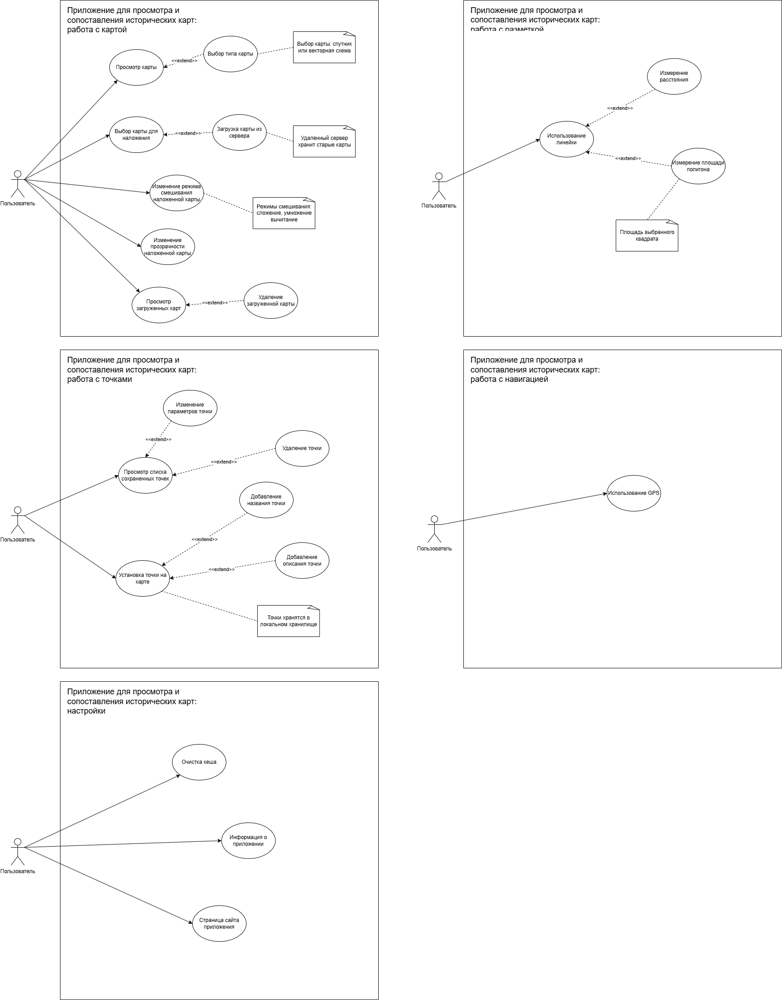

# ТЗ на разработку MVP приложения для просмотра и сопоставления исторических карт

## 1. Краткое описание системы

Разрабатывается система, состоящая из:

- мобильного приложения для Android;
- backend-сервиса каталога исторических карт;
- хранилища файлов карт и связанных ассетов.

Система предназначена для:

- просмотра современной карты;
- загрузки исторических карт из удалённого каталога;
- сохранения исторических карт в локальное хранилище устройства;
- наложения исторической карты на современную подложку;
- настройки визуального сопоставления карт;
- добавления и хранения пользовательских точек;
- выполнения базовых измерений на карте;
- использования GPS для ориентирования;
- выполнения простых сервисных действий в настройках;
- администрирования каталога карт на backend.

Приложение ориентировано на индивидуального пользователя, который исследует местность, сопоставляет исторические и современные картографические данные и сохраняет собственные отметки.

Backend предназначен для хранения и публикации каталога карт, описаний карт и ссылок на файлы карт.

---

## 2. Цель MVP

MVP должен позволять:

### Пользователю мобильного приложения

- открыть карту;
- выбрать тип подложки;
- выбрать историческую карту из локального источника;
- при необходимости загрузить карту с удалённого сервера в локальный источник;
- наложить историческую карту поверх современной карты;
- изменить прозрачность и режим смешивания;
- добавлять точки с названием и описанием;
- просматривать, редактировать и удалять сохранённые точки;
- измерять расстояние и площадь;
- видеть своё текущее местоположение по GPS;
- выполнять базовые действия в настройках.

### Администратору каталога

- создать карточку исторической карты в backend;
- заполнить метаданные карты;
- загрузить `.pmtiles` и связанные файлы;
- публиковать карту в удалённом каталоге;
- редактировать описание карты и связанные данные.

---

## 3. Платформа и стек

### Клиент

- Android
- Kotlin
- Jetpack Compose — UI
- MapLibre — отображение карты
- OSM Tilemaps или совместимый провайдер — современная картографическая подложка
- Ktor Client — сетевое взаимодействие
- Room — локальное хранилище пользовательских данных и индекса локально сохранённых карт
- Coroutines / Flow
- ViewModel / Navigation Compose

### Backend

- Kotlin
- Ktor
- PostgreSQL — хранение сущностей каталога карт
- Flyway — миграции схемы БД
- Docker Compose — локальная среда разработки backend
- файловое хранилище на сервере (volume / директория), используемое для хранения `.pmtiles`, `preview`, `icon` и других связанных файлов

### Ограничения MVP

- не входят регистрация и авторизация конечных пользователей;
- не входят личные кабинеты и облачная синхронизация пользовательских точек;
- не предполагается хранение `.pmtiles` в PostgreSQL;
- backend в MVP является минимальным, но полноценным сервисом каталога карт;
- допускается простое файловое хранилище вместо объектного storage;
- редактор каталога может быть реализован как минимальный административный API без отдельной сложной веб-панели.

---

## 4. Пользователи системы

### 4.1. Основной пользователь

Незарегистрированный пользователь мобильного приложения, работающий локально на одном устройстве.

### 4.2. Администратор каталога

Пользователь backend-части, который создаёт, редактирует и публикует карты в удалённом каталоге.

---

## 5. Границы MVP

### В MVP входят

- просмотр карты;
- выбор типа подложки;
- выбор карты для наложения из локального источника;
- загрузка карты с удалённого сервера в локальный источник;
- просмотр списка локально доступных карт;
- удаление карты из локального источника;
- наложение карты;
- изменение прозрачности;
- изменение режима смешивания;
- постановка точки;
- добавление названия и описания;
- просмотр списка сохранённых точек;
- редактирование параметров точки;
- удаление точки;
- измерение расстояния;
- измерение площади полигона;
- использование GPS;
- экран информации о приложении;
- переход на страницу сайта приложения;
- очистка кэша;
- backend-каталог исторических карт;
- хранение описаний карт, источников, тегов и технических метаданных в PostgreSQL;
- загрузка `.pmtiles` и связанных файлов на backend;
- публикация карт в удалённый каталог;
- миграции схемы базы данных через Flyway.

### В MVP не входят

- регистрация и авторизация конечных пользователей;
- облачная синхронизация точек;
- совместная работа нескольких пользователей;
- маршрутизация;
- офлайн-пакеты современной карты сверх стандартного поведения кэша;
- ручная геопривязка карты пользователем;
- импорт/экспорт пользовательских точек;
- push-уведомления;
- хранение бинарных файлов карт в PostgreSQL;
- сложная система ролей и прав доступа;
- полнофункциональная CMS или расширенная веб-админка.

---

## 6. Функциональные требования

## 6.1. Модуль «Работа с картой»

### FR-1. Просмотр карты

Система должна отображать современную карту на основном экране приложения.

**Условия:**

- карта должна быть доступна для масштабирования и перемещения;
- при первом открытии допускается отображение карты в области по умолчанию;
- при наличии GPS и разрешения пользователя карта может центрироваться на текущем положении.

### FR-2. Выбор типа карты

Система должна позволять пользователю выбирать тип картографической подложки:

- спутник;
- векторная схема.

**Ожидаемое поведение:**

- выбранный тип применяется сразу;
- выбранный тип может сохраняться локально между запусками приложения;
- спутниковая подложка доступна только при наличии интернет-соединения;
- векторная подложка должна быть доступна оффлайн.

### FR-3. Выбор карты для наложения

Система должна позволять пользователю выбрать историческую карту для наложения из локального источника.

**Условия:**

- выбор осуществляется из списка карт, уже доступных локально на устройстве;
- после выбора карта отображается поверх основной карты.

### FR-4. Загрузка карты с удалённого сервера в локальный источник

Система должна позволять пользователю получить карту с удалённого сервера и сохранить её в локальном источнике приложения.

**Минимально необходимо:**

- получение списка доступных исторических карт с удалённого сервера;
- поиск по списку доступных исторических карт;
- выбор карты из списка;
- получение карточки карты;
- загрузка `.pmtiles` и сопутствующей информации;
- сохранение карты в локальном файловом хранилище приложения;
- добавление карты в список локально доступных карт.

**Результат:**

- после завершения загрузки карта становится доступной для выбора и наложения без повторного обращения к серверу;
- локальный источник считается основным местом, откуда пользователь выбирает карты для работы.

### FR-5. Просмотр локально доступных карт

Система должна отображать список исторических карт, доступных в локальном источнике.

**Для каждой карты желательно отображать:**

- название;
- краткое описание или источник, если есть;
- признак локальной доступности;
- `preview` или `icon`, если такие данные доступны.

### FR-6. Удаление карты из локального источника

Система должна позволять пользователю удалить историческую карту из локального источника приложения.

**Результат:**

- карта удаляется из списка локально доступных карт;
- карта больше не может быть выбрана для наложения;
- если удаляемая карта сейчас активна, наложение снимается.

### FR-7. Изменение прозрачности наложенной карты

Система должна позволять пользователю изменять прозрачность активной исторической карты.

**Условия:**

- значение задаётся в диапазоне от 0% до 100%;
- изменение применяется сразу на карте.

### FR-8. Изменение режима смешивания наложенной карты

Система должна позволять пользователю выбирать режим смешивания наложенной карты.

**Минимальный набор режимов:**

- обычный;
- сложение;
- умножение;
- вычитание.

**Требование:**

- изменение режима должно визуально применяться без перезапуска экрана.

---

## 6.2. Модуль «Работа с точками»

### FR-9. Установка точки на карте

Система должна позволять пользователю установить пользовательскую точку на карте.

**Условия:**

- точка ставится по нажатию на карту или через отдельный режим добавления;
- сохраняются координаты точки.

### FR-10. Добавление названия точки

При создании или редактировании точки система должна позволять указать название точки.

**Условия:**

- поле рекомендуется сделать обязательным для MVP;
- длина названия должна быть ограничена разумным пределом.

### FR-11. Добавление описания точки

При создании или редактировании точки система должна позволять указать описание точки.

**Условия:**

- описание является необязательным;
- текст описания хранится локально.

### FR-12. Просмотр списка сохранённых точек

Система должна отображать список всех сохранённых пользователем точек.

**Для каждой точки желательно показывать:**

- название;
- координаты или краткое представление местоположения;
- дату создания.

### FR-13. Изменение параметров точки

Система должна позволять пользователю редактировать параметры сохранённой точки.

**Редактируемые параметры:**

- название;
- описание.

### FR-14. Удаление точки

Система должна позволять пользователю удалить сохранённую точку.

**Результат:**

- точка удаляется из локального хранилища;
- точка исчезает из списка и с карты.

### FR-15. Хранение точек в локальном хранилище

Система должна сохранять пользовательские точки локально на устройстве.

---

## 6.3. Модуль «Разметка и измерения»

### FR-16. Использование линейки

Система должна предоставлять пользователю режим линейки для измерений на карте.

### FR-17. Измерение расстояния

В режиме линейки система должна позволять пользователю выбрать две или более точек и получить длину отрезка или последовательности сегментов.

**Результат:**

- расстояние отображается на экране;
- единицы измерения: метры и километры.

### FR-18. Измерение площади полигона

Система должна позволять пользователю построить замкнутый полигон и вычислить площадь выделенной области.

**Результат:**

- площадь отображается на экране;
- единицы измерения: квадратные метры и/или гектары.

---

## 6.4. Модуль «Навигация»

### FR-19. Использование GPS

Система должна позволять определить текущее местоположение пользователя и отобразить его на карте.

**Условия:**

- при отсутствии разрешения должно быть показано понятное сообщение;
- при недоступности GPS должен отображаться соответствующий статус;
- должно поддерживаться центрирование карты на пользователе.

---

## 6.5. Модуль «Настройки»

### FR-20. Очистка кэша

Система должна позволять пользователю очищать кэш приложения.

**Под очисткой кэша в MVP понимается:**

- удаление временных сетевых данных;
- удаление временных файлов, не относящихся к пользовательским данным;
- без удаления пользовательских точек и без удаления карт, сохранённых в локальном источнике, если пользователь явно не инициировал это отдельно.

### FR-21. Информация о приложении

Система должна отображать экран с информацией о приложении.

**Минимальное содержимое:**

- название приложения;
- версия;
- краткое описание;
- ссылка на проект или контактная информация.

### FR-22. Страница сайта приложения

Система должна позволять открыть страницу сайта приложения или проекта.

**Реализация MVP:**

- открытие внешней ссылки в браузере.

---

## 6.6. Модуль «Backend каталога карт»

### FR-23. Хранение каталога карт

Backend должен хранить сущности карт в PostgreSQL.

**Для каждой карты минимально должны храниться:**

- уникальный идентификатор;
- slug;
- название;
- описание;
- источник или краткое указание происхождения карты;
- временная метка периода или года;
- технические метаданные карты;
- статус публикации;
- ссылки или пути к связанным файлам.

### FR-24. Хранение файлов карты

Backend должен хранить файлы, связанные с картой, отдельно от PostgreSQL.

**Минимально допускается хранение:**

- `.pmtiles`;
- `preview`;
- `icon`.

**Требование:**

- файлы должны храниться в файловом хранилище сервера;
- PostgreSQL должен хранить только метаданные и ссылки/пути к файлам;
- хранение бинарных данных карт в БД не допускается в рамках MVP.

### FR-25. Публичный каталог карт

Backend должен предоставлять API для получения каталога опубликованных карт.

**Минимально необходимо:**

- получение списка опубликованных карт;
- получение карточки одной карты;
- получение ссылки на загрузку `.pmtiles` и связанных файлов.

### FR-26. Администрирование карт

Backend должен предоставлять административные операции для управления каталогом.

**Минимально необходимо:**

- создание карты;
- редактирование метаданных;
- загрузка файлов карты;
- публикация и снятие с публикации.

### FR-27. Миграции БД

Схема базы данных backend-а должна изменяться только через миграции.

**Требование:**

- для миграций должен использоваться Flyway;
- изменения структуры таблиц вручную вне миграций не считаются допустимым способом сопровождения системы.

---

## 7. Нефункциональные требования

## 7.1. Требования к интерфейсу

- Интерфейс должен быть реализован на Jetpack Compose.
- Основной пользовательский сценарий должен быть понятен без отдельного обучения.
- Ключевые действия на карте должны выполняться не более чем в 2–3 шага.
- Интерфейс должен быть адаптирован под вертикальную ориентацию экрана.
- Элементы управления должны быть удобны для использования на экранах смартфонов.

## 7.2. Производительность

- Основной экран карты должен открываться без критических задержек.
- Перемещение и масштабирование карты должны происходить плавно на целевых устройствах среднего уровня.
- Изменение прозрачности наложения должно применяться почти мгновенно.
- Работа с локальными точками и локально сохранёнными картами не должна требовать сетевого соединения.
- Backend должен отвечать на запросы каталога без критических задержек при небольшом количестве карт.

**Ориентиры для MVP:**

- старт приложения: до 3 секунд на типичном устройстве;
- открытие списка точек или локальных карт: до 1 секунды при небольшом объёме данных;
- реакция UI на действия пользователя: без визуально заметных зависаний;
- выдача каталога backend-ом: до 1 секунды при небольшом количестве записей.

## 7.3. Надёжность

- Приложение не должно аварийно завершаться при отсутствии сети, отказе сервера, пустом списке удалённых карт, отсутствии GPS или отказе пользователя в разрешениях.
- При ошибках должны отображаться понятные сообщения без технических подробностей.
- Backend не должен терять опубликованные метаданные карт при пересборке контейнера.
- Файлы карт не должны теряться при перезапуске backend-сервиса при условии корректно подключённого volume/файлового хранилища.

## 7.4. Работа без сети

- Уже сохранённые в локальном источнике карты и пользовательские точки должны быть доступны без интернета.
- Для загрузки новых карт с удалённого сервера интернет обязателен.
- Спутниковая подложка должна быть доступна только онлайн.
- Векторная подложка должна быть доступна оффлайн.

## 7.5. Хранение данных

### На клиенте

- Пользовательские точки должны храниться локально в Room.
- Настройки пользователя должны сохраняться локально.
- Карты, загруженные с удалённого сервера, должны сохраняться в локальном файловом источнике приложения.
- Очистка кэша не должна удалять пользовательские точки и локально сохранённые карты.

### На backend

- Метаданные каталога карт должны храниться в PostgreSQL.
- `.pmtiles`, `preview`, `icon` и другие бинарные файлы должны храниться вне PostgreSQL.
- Пути или ссылки на файлы должны храниться в PostgreSQL.
- Конфигурация подключения к БД и другие чувствительные параметры должны передаваться через переменные окружения.

## 7.6. Безопасность и приватность

- MVP не предполагает регистрацию и передачу персональных данных конечных пользователей, кроме сетевых запросов для получения карт с удалённого сервера.
- Геопозиция пользователя не должна отправляться на сервер.
- Разрешения Android должны запрашиваться только по факту необходимости.
- Backend не должен предоставлять неопубликованные карты через публичный каталог.

## 7.7. Поддерживаемость

- Архитектура клиента должна допускать дальнейшее расширение: подключение backend API, синхронизацию точек, авторизацию и развитие источника карт.
- Архитектура backend-а должна допускать дальнейшее расширение: авторизацию, редактор каталога, фильтры и поиск.
- Код клиента должен быть разделён как минимум на слои UI, domain/business logic и data.
- Код backend-а должен быть разделён как минимум на слои routes, service/business logic, repository и storage.

## 7.8. Технические ограничения

### Клиент

- Клиентская часть должна быть написана на Kotlin.
- UI должен быть реализован на Jetpack Compose.
- Работа с картой должна быть реализована через MapLibre.
- Источник базовой карты — OSM Tilemaps или совместимый тайловый провайдер.
- Сетевое взаимодействие должно быть реализовано через Ktor Client.
- Локальное хранилище пользовательских данных — Room.

### Backend

- Backend должен быть написан на Kotlin.
- HTTP API backend-а должно быть реализовано через Ktor.
- Для хранения сущностей каталога должен использоваться PostgreSQL.
- Для миграций должен использоваться Flyway.
- Для локальной разработки backend-а должен использоваться Docker Compose.
- Для хранения файлов карт допускается файловый volume/директория.

---

## 8. Основные пользовательские сценарии

### Сценарий 1. Наложение исторической карты

1. Пользователь открывает приложение.
2. Видит современную карту.
3. Открывает список локально доступных исторических карт.
4. Если нужной карты нет, переходит к загрузке с удалённого сервера.
5. Получает список опубликованных удалённых карт.
6. Загружает выбранную карту в локальный источник.
7. Пользователь выбирает карту из локального источника.
8. Включает наложение.
9. Меняет прозрачность и режим смешивания.
10. Сопоставляет историческую карту с современным видом.

### Сценарий 2. Добавление точки

1. Пользователь выбирает режим добавления точки.
2. Нажимает на место на карте.
3. Вводит название.
4. При необходимости вводит описание.
5. Сохраняет точку.
6. Точка появляется на карте и в списке.

### Сценарий 3. Измерение расстояния

1. Пользователь включает линейку.
2. Указывает точки на карте.
3. Система рассчитывает расстояние.
4. Результат отображается на экране.

### Сценарий 4. Навигация

1. Пользователь даёт разрешение на геолокацию.
2. Приложение получает координаты.
3. На карте отображается текущая позиция пользователя.

### Сценарий 5. Публикация карты в каталог

1. Администратор создаёт запись новой карты в backend.
2. Заполняет название, описание, источник и другие метаданные.
3. Загружает `.pmtiles` и связанные файлы.
4. Проверяет корректность карточки карты.
5. Переводит карту в опубликованный статус.
6. Карта становится доступной в удалённом каталоге для мобильного клиента.

---

## 9. Минимальный набор экранов MVP

### Клиент

1. **Главный экран карты**
   - карта;
   - выбор подложки;
   - выбор активной исторической карты;
   - прозрачность;
   - режим смешивания;
   - GPS;
   - переход в измерение;
   - переход в работу с точками.

2. **Экран локальных карт**
   - список карт, доступных в локальном источнике;
   - выбор активной карты;
   - удаление карты;
   - переход к загрузке с удалённого сервера.

3. **Экран загрузки карты с удалённого сервера**
   - список доступных удалённых карт;
   - действие «загрузить в локальный источник».

4. **Экран списка точек**
   - список сохранённых точек;
   - открыть на карте;
   - редактировать;
   - удалить.

5. **Экран создания/редактирования точки**
   - название;
   - описание;
   - подтверждение сохранения.

6. **Экран настроек**
   - очистка кэша;
   - информация о приложении;
   - переход на сайт проекта.

### Backend

Отдельная полнофункциональная веб-панель не обязательна для MVP.  
Допускается использование административного API или минимального служебного интерфейса.

---

## 10. Критерии готовности MVP

MVP считается пригодным к использованию, если:

- карта отображается и управляется пользователем;
- подложка переключается;
- историческая карта может быть загружена с удалённого сервера в локальный источник;
- карта может быть выбрана из локального источника и наложена;
- прозрачность и режим смешивания работают;
- точки создаются, сохраняются, редактируются и удаляются;
- расстояние и площадь измеряются;
- GPS-позиция отображается;
- настройки доступны;
- backend хранит каталог карт в PostgreSQL;
- backend отдаёт список опубликованных карт и карточку карты;
- `.pmtiles` и связанные файлы хранятся отдельно от PostgreSQL;
- схема базы данных поднимается миграциями Flyway;
- приложение и backend устойчиво работают в типовых сценариях без критических сбоев.